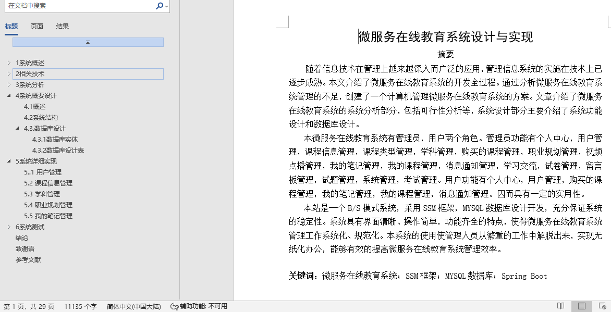
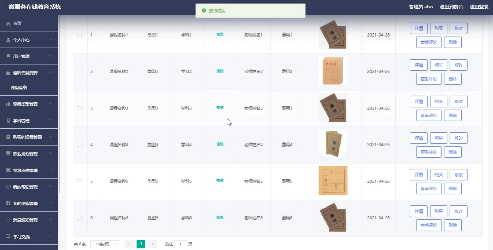
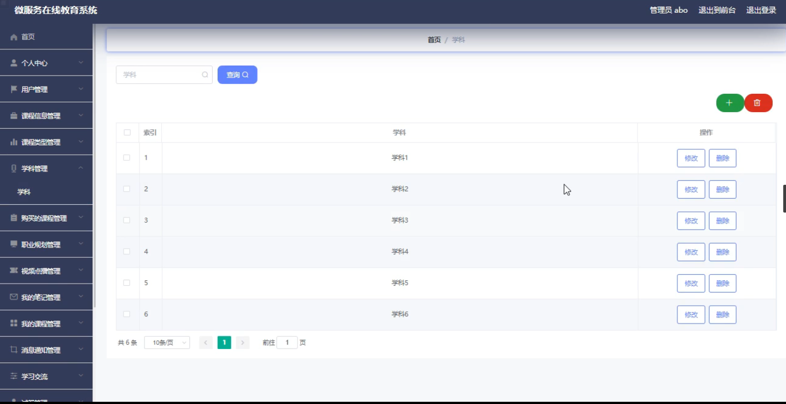
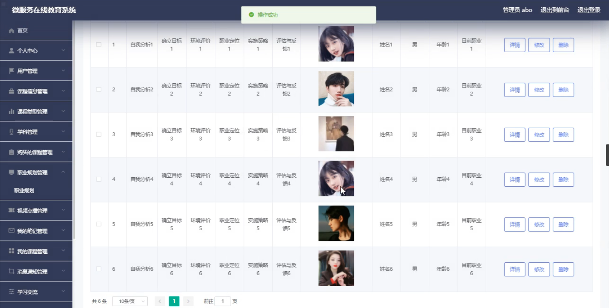
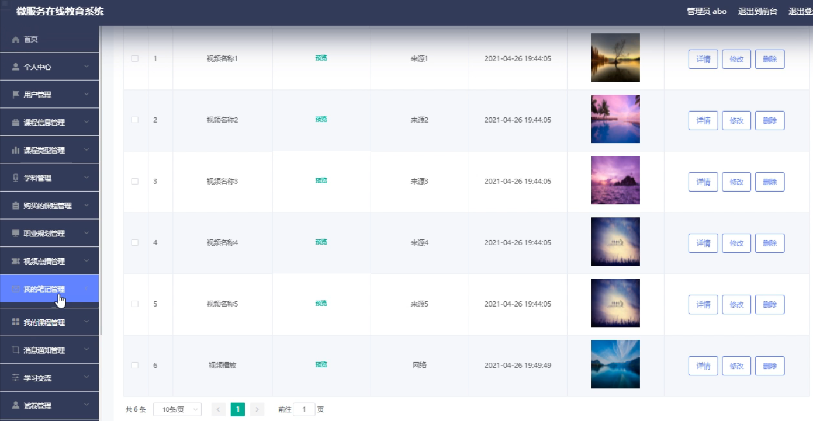
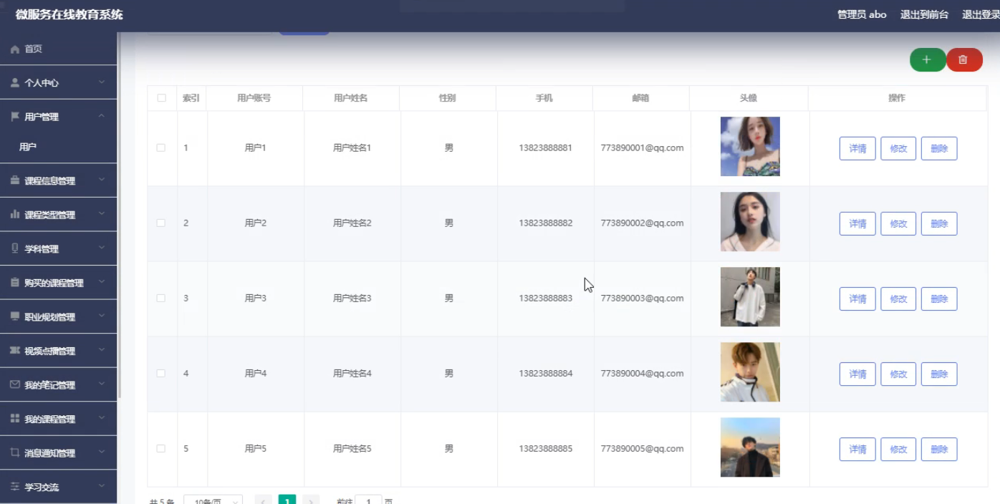

## 在线教育系统(程序+报告)

###  获取sql数据库文件: 从戎源码网 (https://armycodes.com/) QQ: 386869957 QQ群: 377586148
###  所有系统地址: (https://github.com/YuLin-Coder/AllProjectCatalog) 
###  所有项目以及源代码本人均调试运行无问题 可支持远程安装部署调试、定制修改、代码讲解

## 项目介绍
在线教育系统，系统包含两种角色：用户、管理员，系统分为前台和后台两大模块，主要功能如下：

1 用户管理
- 功能: 系统管理员可以对用户信息进行添加、修改、删除和查询操作。

2 课程信息管理
- 功能: 系统管理员可以对课程信息进行添加、修改、删除和查询操作。

3 学科管理
- 功能: 系统管理员可以对学科信息进行修改、删除和查询操作。

4 职业规划管理
- 功能: 系统管理员可以对职业规划信息进行修改和查询操作。

5 我的笔记管理
- 功能: 系统管理员可以查看、修改和删除笔记信息。

## 项目技术
- 编程语言：Java
- 数据库：MySQL
- 项目管理工具：Maven
- 前端技术：HTML、CSS、JavaScript、Vue
- 后端技术：Spring、SpringMVC、MyBatis

## 运行环境
- JDK版本：JDK1.8及以上
- 开发工具：IDEA、Ecplise、Myecplise都可以
- 数据库: MySQL5.7及以上
- Maven：maven3.0及以上
- Node：14.14.0及以上

## 运行截图

